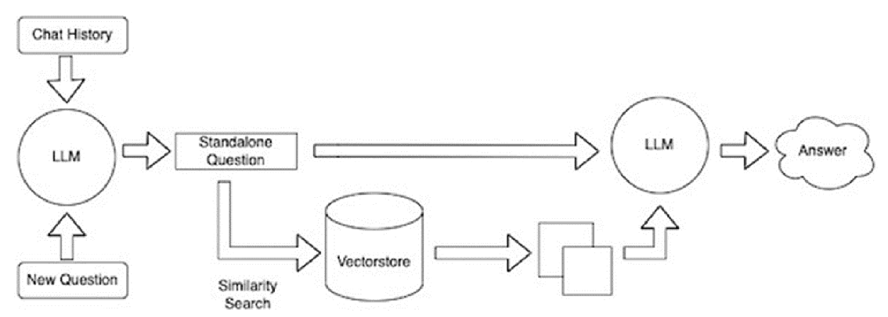

# MIT-GPT: General Purpose Assistance Model for MIT World Peace University 🎓

MIT-GPT is an AI-powered assistant designed for students and staff at MIT World Peace University (MIT-WPU). It leverages open-source Large Language Models (LLMs) and Retrieval-Augmented Generation (RAG) to provide contextual answers grounded in real MIT-WPU data.

---

## 🚀 Features

- ✅ RAG-based architecture for factual grounding
- 🤖 Local LLM using Mistral (GGUF format via `llama-cpp`)
- 🧠 Custom-trained knowledge base from MIT-WPU datasets
- 🖥️ React-based frontend for user interaction *(or Streamlit)*
- 🔐 Fully offline, no OpenAI keys required

---

## 🧠 System Architecture


### 🔄 RAG Pipeline
```
User Question → Vector DB Retrieval (ChromaDB) → Injected into Prompt → Local LLM (llama2) → Response
```

1. **Data Source**: CSV file with MIT-WPU question-answer pairs
2. **Embedding**: Answers are embedded using `sentence-transformers/all-MiniLM-L6-v2`
3. **Storage**: Stored in `ChromaDB` as vector chunks
4. **Retrieval**: Top `k` similar answers retrieved based on the user’s query
5. **Prompting**: Retrieved context is inserted into a structured prompt
6. **LLM Response**: LLaMA-compatible local model generates grounded answers

---

## 📁 Folder Structure

```
MIT_GPT/
├── application/
│   ├── ingest.py            # Embeds CSV answers into ChromaDB
│   ├── query.py             # Retrieval and LLM logic
│   ├── prompts.py           # Custom prompt templates
├── data/
│   └── mit_wpu_docs/
│       └── indexednewtrans.csv  # CSV with 'question', 'answer'
├── models/                  # .gguf model files (excluded via .gitignore)
├── chroma_db/               # Persistent vector store
├── frontend/                # React or Streamlit UI
│   └── app.py
├── .env                     # Contains MODEL_PATH, CHROMA_PATH
├── .gitignore
├── README.md
└── main.py                  # (Optional) CLI or test interface
```

---

## ⚙️ Setup Instructions

### 1. 📦 Install Dependencies
```bash
pip install -r requirements.txt
```

Also install `llama-cpp-python`, `chromadb`, etc.

### 2. 📥 Download GGUF Model
Place your LLaMA `.gguf` model in:
```
./models/llama-2-7b-chat.Q2_K.gguf
```

Update `.env`:
```env
MODEL_PATH=./models/llama-2-7b-chat.Q2_K.gguf
CHROMA_PATH=./chroma_db
```

---

### 3. 📚 Ingest Data
```bash
python application/ingest.py
```

This will create embeddings from your CSV file and populate ChromaDB.

---

### 4. 🧪 Run the App

#### Option A: Streamlit Frontend
```bash
streamlit run frontend/app.py
```

#### Option B: CLI Testing
```bash
python main.py
```

---

## 🧾 Example Query
> **Q:** How can I get a new copy of corrected grade cards?  
> **A:** You must apply through the ERP portal and contact the Controller of Examinations for assistance.

---

## ✅ To Do

- [ ] Improve prompt templates for fuzzy queries
- [ ] Switch to React frontend with FastAPI backend
- [ ] Add session memory for follow-up questions

---

## 📜 License

This project is for educational and research purposes under MIT-WPU. All data belongs to the university and is not intended for commercial use.
